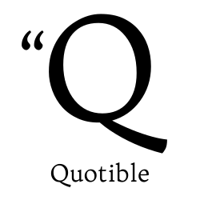

<!-- AUTO-GENERATED-CONTENT:START (STARTER) -->

  

<h1 align="center">
  Lucas's Dev Portfolio 
</h1>

## Project Links

### Backend API

[Quotible backend API](https://quotible-backend.herokuapp.com/)
[Quotible backend API Swagger](https://quotible-backend.herokuapp.com/api-docs/#)
[Quotible backend API repo](https://github.com/LucasZapico/quotible-backend)

### Frontend

[Quotible frontend](https://quotible-react-frontend.herokuapp.com/)
[Quotible frontend repo](https://github.com/LucasZapico/quotible-react-frontend)

# Reference

[How to build a REST API with Node.js and Express](https://www.youtube.com/watch?v=pKd0Rpw7O48)

## Todo

- [ ] add swagger documentation (wip)
